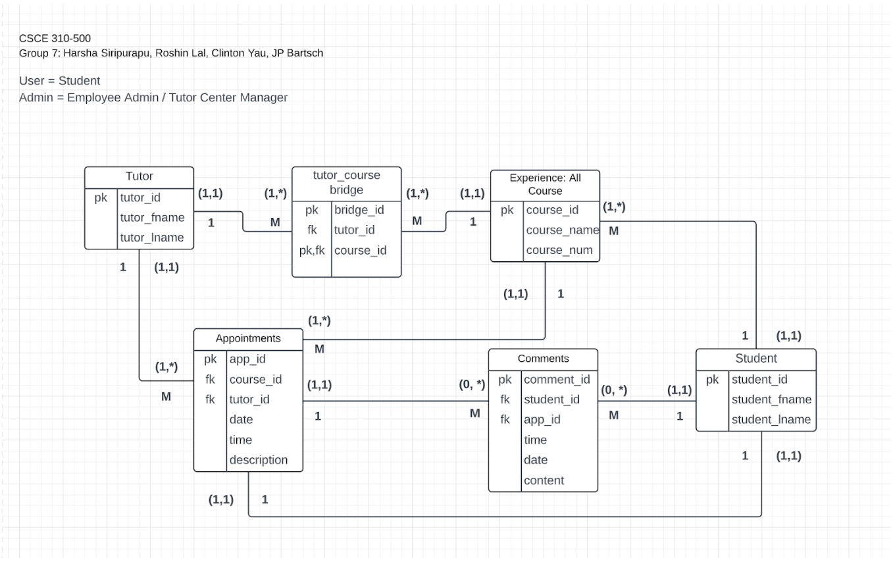
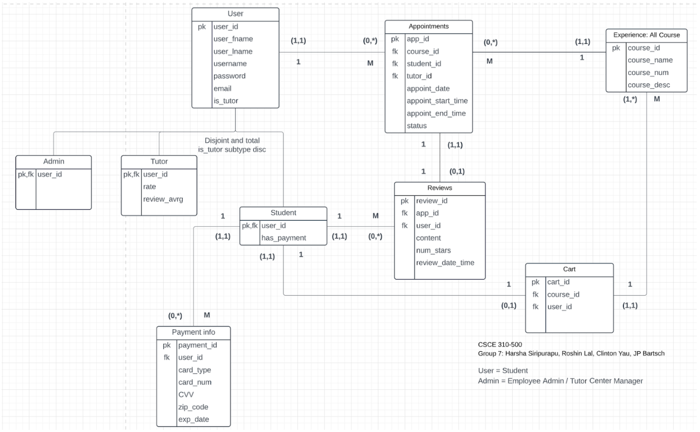
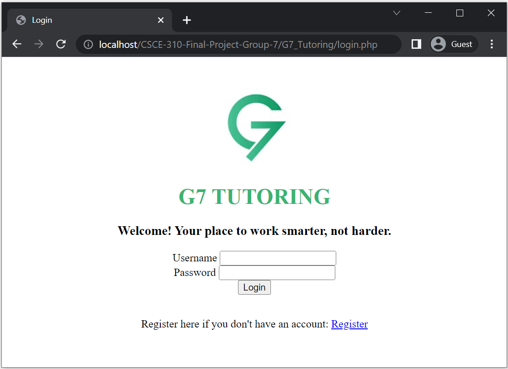

# Fall 2022 CSCE 310 - Database Systems
Group 7: JP Bartsch, Roshin Lal, Harsha Siripurapu, Clinton Yau
#
General Pages
- login.php - Page for logging in.
- register.php - Page for registering account.
- registerUser.php - Page for registering user (student/tutor/admin) account.
- loginRegBackend.php - Backend code for login.php, register.php, registerUser.php

User Pages
- userHomePage.php - Home page for user after logging in. From here, the user can navigate to edit their profile, set up appointments, sign up for courses, and give reviews.
- userProfileEdit.php - Page that allows user to view/update their user account details, add/view/delete payment information, and delete their user account.
- userProfileEditBackend.php - Backend code for userProfileEdit.php
- userAppointment.php - Page that allows user to create/view/update/delete scheduled appointments.
- userAppointmentBackend.php - Backend code for userAppointment.php
- userCourses.php - Page that allows user to view/add/delete courses to cart.
- userCoursesBackend.php - Backend code for userCourses.php
- userCoursePayment.php - Page that allows user to make a payment to check out and view the courses they've selected.
- userReview.php - Page that allows user to create/view/update/delete reviews.
- userReviewBackend.php - Backend code for userReview.php

Admin Pages
- adminHomePage.php - Home page for admin after logging in. From here, the admin can navigate to edit their profile, register a user account, update a user account profile, manage all appointments, manage all courses, and manage all reviews.
- adminProfileEdit.php - Page that allows admin to view/update their user account details, and delete their user account.
- adminProfileEditBackend.php - Backend code for adminProfileEdit.php
- adminUserProfileEdit.php - Page that allows admin to view/update a user (student/tutors) profile details, add/delete user payment information, and delete a user's account.
- adminUserProfileEditBackend.php - Backend code for adminUserProfileEdit.php
- adminAppointment.php - Page that allows admin to view all student/tutors/courses, create an appointment between any student and tutor, and update/delete any appointments.
- adminAppointmentBackend.php - Backend code for adminAppointment.php
- adminCourses.php - Page that allows admin to create/view/update/delete courses.
- adminCoursesBackend.php - Backend code for adminCourses.php
- adminReview.php - Page that allows admin to create/view/update/delete reviews.
- adminReviewBackend.php - Backend code for adminReview.php

#
Index
- Index on username
    - Used by: Clinton Yau - Profile (User) and Scheduling (Admin)
    - Used by: Roshin Lal - Profile (Admin)
- Indexes on user’s first name and last name
    - Used by: JP Bartsch - Reviews (Admin)
- Indexes on course number
    - Used by: Harsha Siripurapu - Reviews (User) and Courses (Admin)

Views
- appointments_table_with_names - Joins the course, user, and appointments tables together
    - Used by: Clinton Yau - Scheduling (Admin)
- reviews_table_with_names - Joins review, appointment, course, and user tables together
    - Used by: JP Bartsch - Reviews (Admin)
    - Used by: Harsha Siripurapu - Reviews (User)
- user_courses_cart - Joins user, courses, and cart tables together
    - Used by: Harsha Siripurapu - Courses (admin)
- user_table_with_paymentinfo - Joins user table with payment information
    - Used by:  Roshin Lal - Profile (Admin)

#
ERD Design Iteration 1 (INITIAL VERSION)

ERD Design Iteration 2 (FINAL VERSION)

G7 Tutoring Landing Page

